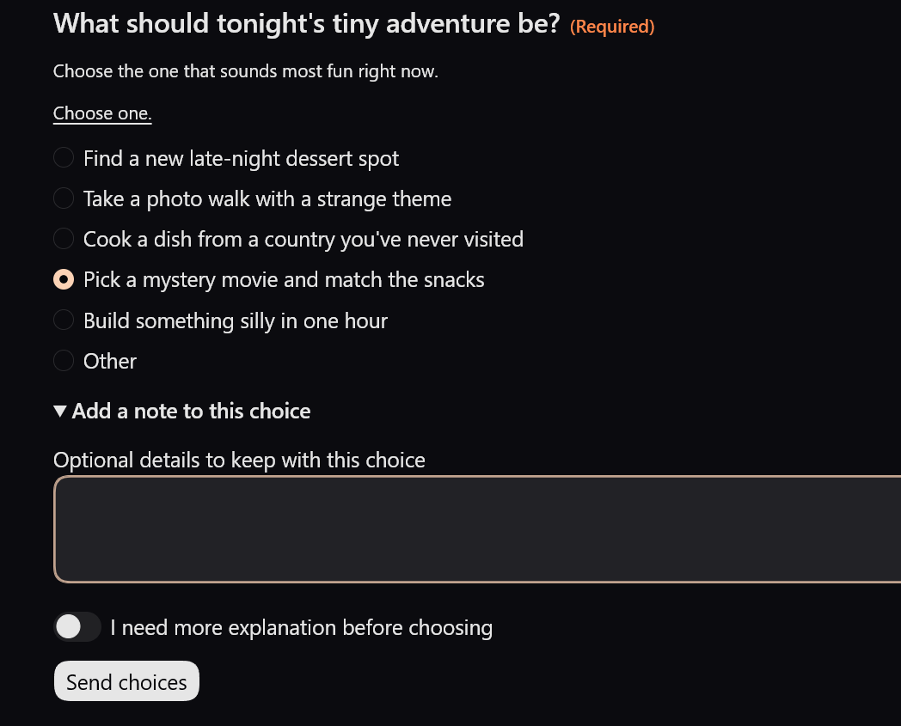
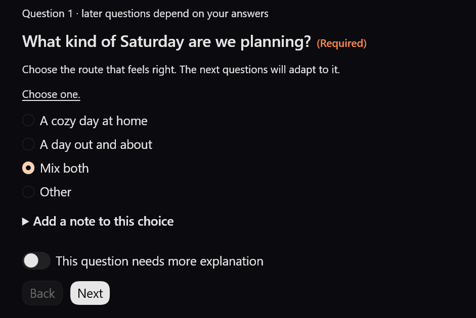
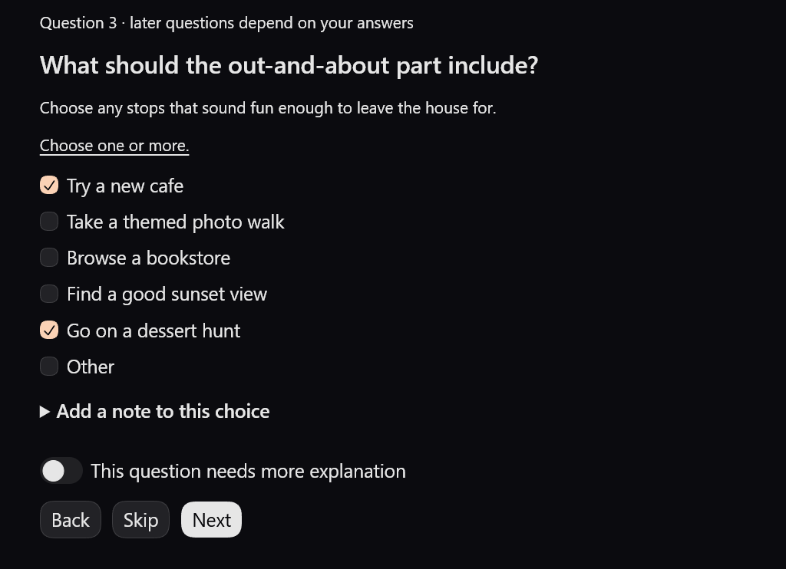
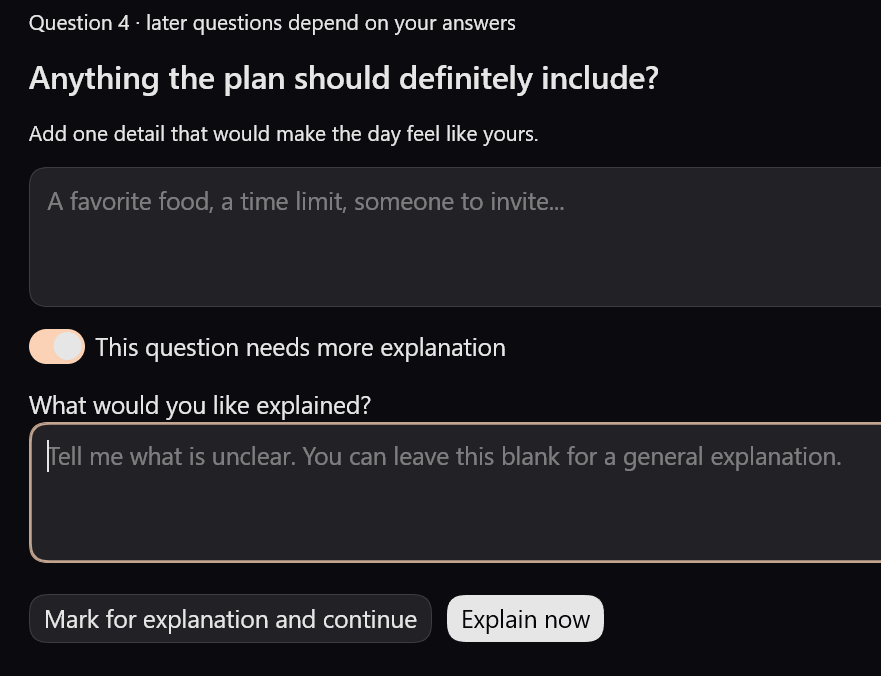
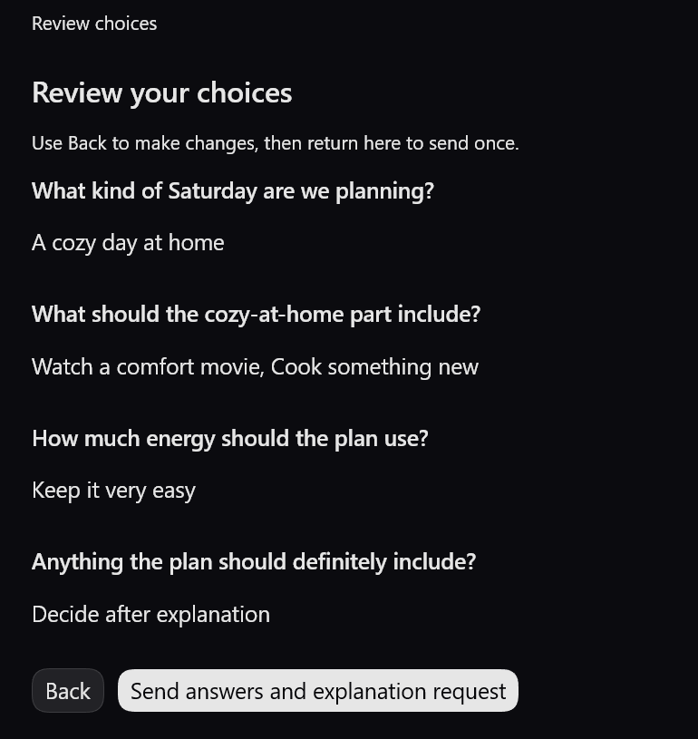

# Choice Board for Codex

> **Answer more. Type less.**
>
> Unofficial community project. Not affiliated with or endorsed by OpenAI.

Choice Board turns a batch of related Codex questions into one small interactive
board. Pick from single-choice or multiple-choice options, add free text or a
short note, ask for an explanation when something is unclear, and send the
finished answers back to the same conversation.

No MCP server, localhost service, tunnel, database, or separate web app is
required.

## Why I built it

I was used to choice pickers in other tools, and I missed that rhythm in normal
Codex work. The closest built-in flow I had used was tied to Plan mode. When a
regular task asked five or six related questions, I still had to type each
answer out, keep the numbering straight, and make sure I had not skipped
anything. It kept breaking the flow, so I built the interaction I wanted to use.

For a few questions, the board keeps everything together so the options are
easy to compare. Longer sets become a guided flow with Back, Skip, notes, and a
final review. I also added something I had not found in the other choice
interfaces I used: bounded branching. One earlier answer can hide prewritten
follow-ups that no longer apply, so Codex can gather more complicated context
with fewer unnecessary questions and fewer turns.

The board follows Codex's own theme and native controls. It deliberately avoids
decorative CSS effects and heavy animation that could make a simple form feel
sluggish, especially on modest hardware. And when an AI-generated option leans
on jargon or hidden context, you can mark that question for explanation instead
of guessing what it means.

This is a small unofficial tool, but I would be happy to see this kind of
multi-question interaction become a built-in part of Codex someday.

## See it in action

### Short boards keep the choices together

When the question set is small, the options stay on one board. You can pick an
answer, add a note, ask for an explanation, and send everything without typing
out a numbered reply.



### Longer boards follow the route you choose

A branching board starts with one routing choice. Only prewritten follow-up
questions that still apply to that answer are shown.



The next step changes with the route while keeping familiar Back, Skip, and
Next controls.



### Ask for context, then review once

If a question is unclear, you can ask for an explanation immediately or mark
it for later and finish the rest first.



Before anything is sent, the board gathers the active answers and unresolved
explanation requests into one review.



## Interaction modes

| Mode | Best for | Behavior |
| --- | --- | --- |
| Compact | 1–3 fixed questions | Shows the questions together and submits once. |
| Guided | 4 or more fixed questions | Shows one question at a time with Back, Skip, explanation, notes, and final review. |
| Bounded branching | Prewritten follow-ups that genuinely depend on one earlier choice | Uses one layer of `show_if` conditions, clears hidden state, and returns the exact active path. |

Guided and bounded-branching boards do not have an arbitrary question-count
ceiling. The renderer still enforces per-field and fragment-size safety limits.
Nested predicates and model-generated follow-up branches are deliberately out
of scope.

## Requirements and support

- ChatGPT desktop app with Codex
- OpenAI's **Visualize** plugin installed and enabled
- Python 3.10 or newer available to Codex

| Surface | Status |
| --- | --- |
| Codex Desktop on Windows | Live tested |
| Codex Desktop on macOS | Intended, not independently verified yet |
| Mobile | Not currently supported interactively; plain-text fallback only |
| Codex CLI and IDE extension | Not currently claimed |

Plugin availability can vary by plan, workspace settings, role, surface, or
region. When Visualize is unavailable—or when a phone shows the raw inline
visualization directive—the skill immediately falls back to equivalent numbered
text questions in the same conversation.

OpenAI currently describes Visualizations as rolling out to eligible mobile
accounts. That rollout does not establish Choice Board compatibility or a
support date. This project will keep the text fallback until rendering,
interaction, follow-up delivery, and retry are verified on an eligible mobile
account. See the [official Visualizations documentation](https://learn.chatgpt.com/docs/visualizations).

Built-in interface copy supports English and Korean. Question and option text
stays in the language used by the caller, while unsupported interface locales
fall back to English.

## Installation

1. In the ChatGPT desktop app, open **Plugins**, find **Visualize** by OpenAI,
   and install or enable it.
2. Ask Codex to install the skill from this repository:

   ```text
   $skill-installer Install the skill from https://github.com/MJL-ren/Choice-Board-for-Codex/tree/main/skills/codex-choice-board
   ```

3. Open the slash menu and try `/codex-choice-board`. If it does not appear
   immediately, start a new Codex task or restart the desktop app, then confirm
   that both the skill and Visualize are enabled.

OpenAI documents direct skill installation as a local authoring and
experimentation path. A packaged Codex plugin is the preferred route for wider
reusable distribution; this repository currently publishes the direct skill
folder while that packaging path is evaluated.

## Try it

The guaranteed invocation form is:

```text
$codex-choice-board Ask me 6 questions to narrow down a weekend activity. Let me choose more than one preference, add a note to an answer, and ask for an explanation before deciding.
```

Direct requests such as “give me choices” or “show this in a choice board” are
also recognized. The default remains fail-closed: the skill does not suggest or
open a board for unrelated requests unless the user explicitly changes the
activation mode to `suggest` or `auto`.

Ready-to-render examples are available in:

- [`examples/basic-en.json`](examples/basic-en.json)
- [`examples/basic-ko.json`](examples/basic-ko.json)
- [`examples/guided-ko.json`](examples/guided-ko.json)
- [`examples/branching-ko.json`](examples/branching-ko.json)

## How it works

1. Codex converts the questions into the canonical Choice Board schema.
2. A deterministic Python renderer strictly rejects duplicate JSON keys,
   non-finite numbers, unknown fields, and invalid schema values before
   injecting the canonical data into a fixed, root-scoped HTML fragment.
3. Visualize displays native controls using the host theme.
4. The board calls `window.openai.sendFollowUpMessage(...)` to request one
   follow-up in the current conversation.
5. The receiving Codex task runs the bundled envelope validator against the
   same canonical specification before using the response. The validator checks
   the marker, readable-summary parity, form identity, exact question keys,
   answer types, option values, flow digest, active path, completion parent, and
   duplicate-submission identity.

A fulfilled host call is not treated as proof that the message reached the
conversation. The board keeps the draft available and offers an explicit,
byte-identical retry with the same `submission_id`. Automatic retry is never
used.

## Data and safety boundary

- Submitted answers appear in the current Codex conversation.
- The skill does not send answers to a separate server or database.
- Canonical JSON and rendered HTML are created in the task's local visualization
  directory. Codex Desktop controls that directory's retention; files may
  remain after submission or app restart, and restored boards may contain
  `initial_*` answer state. Choice Board has no host cleanup API and does not
  promise automatic deletion.
- Returned messages may be copied briefly into the same task directory for
  deterministic envelope validation. Those extra copies should be removed when
  the original task, retry, explanation, and completion flow no longer need
  them. Generated boards, validation copies, and user responses do not belong
  in this repository.
- Only the user-controlled activation preference is stored locally by the
  skill.
- Do not use the board to collect secrets, credentials, sensitive personal
  data, or final approval for destructive or external actions.
- Human-readable labels are presentation. The compact JSON envelope is the
  authority, and disagreement fails closed.

See [`SECURITY.md`](SECURITY.md) for reporting and trust-boundary details.

## Tested in real use

Choice Board is tested beyond a static mockup. The automated suite covers schema
validation, escaping, compilation, branch state, retry behavior, and the full
returned message. Browser checks cover compact, guided, answer-note, branching,
locale fallback, a 30-question guided flow, 320px and 736px layouts, and Codex
light and dark themes. Real Windows Codex Desktop runs have also exercised
submission, cancellation recovery, Back preservation, immediate and deferred
explanation, answer notes, and one bounded branch.

These checks do not claim screen-reader certification, automatic mobile-device
detection, or support on untested Codex surfaces. The exact boundary is recorded
in [`docs/TESTING.md`](docs/TESTING.md).

## Development

Install the browser-test dependency:

```powershell
npm install
npx playwright install chromium
```

Run the Python suite:

```powershell
python -m unittest discover -s tests -p "test_*.py" -v
```

Validate the skill package:

```powershell
python -m pip install PyYAML==6.0.2
python tests/run_official_skill_validator.py
```

The runner downloads the OpenAI `skill-creator` quick validator from a pinned
official commit and verifies its SHA-256 hash before execution.
Browser commands and generated-fixture steps are documented in
[`docs/TESTING.md`](docs/TESTING.md).

Run every browser regression after installing Playwright:

```powershell
npm run test:browser
```

## Built through real use

Codex and GPT-5.6 helped turn repeated live UX failures into the
delivery-recovery contract, canonical schema, renderer, compiler, adversarial
fixtures, and browser tests. The product boundaries were deliberate human
choices: desktop-first interaction, a plain-text fallback, no server, explicit
activation by default, answer notes, explanation requests, and only one bounded
layer of branching.

## Documentation

- [`docs/PROJECT_BRIEF.md`](docs/PROJECT_BRIEF.md) — product and runtime contract
- [`docs/OPEN_DECISIONS.md`](docs/OPEN_DECISIONS.md) — resolved design decisions
- [`docs/TESTING.md`](docs/TESTING.md) — current validation evidence and limits
- [`skills/codex-choice-board/references/schema.md`](skills/codex-choice-board/references/schema.md) — canonical input and callback schema

Contributions are welcome; read [`CONTRIBUTING.md`](CONTRIBUTING.md) before
opening a change.

## License

[MIT](LICENSE)
